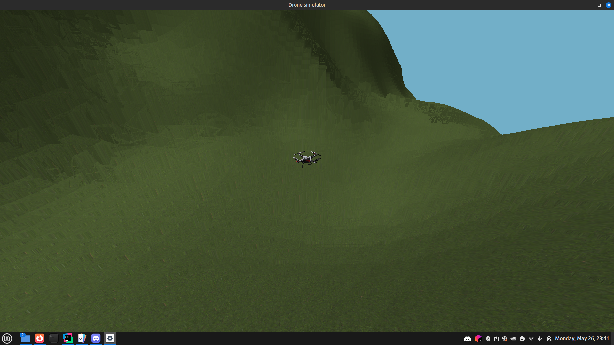

# Drone simulator



## Introduction
This is a simple "game" where you can fly a drone above a 3D terrain.
The collision system blocks you from flying through other objects, especially the terrain.

## Algorithms/libraries used
- rendering: OpenGL
- terrain generation - Perlin Noise algorithm
- collision system - GJK algorithm with a sphere optimization

## Build requirements
Cmake: at least 3.28

## How to build
I tested it only on Linux. To make it work, run in the main directory:

```bash
cmake -S . -B build
cd build
make
```

## How to run game
After building, go back to the main directory. Then run:

```bash
./build/game
```

## Controls
- Move forward: "w" or "arrow up"
- Move backward: "s" or "arrow down"
- Move right: "d" or "arrow right"
- Move left: "a" or "arrow left"
- Move up: "q" or "space"
- Move down: "e" or "shift"
- Close: "escape"
- Third person camera: "key 1"
- First person camera: "key 2"
- Top down camera: "key 3"

## Configuration
Some of the simulation's parameters can be modified in config/config.json.

## How to run tests
I've done some unit tests (currently only for the collision system)
If you want to run them, run in the main directory.
```bash
./build/tests
```
